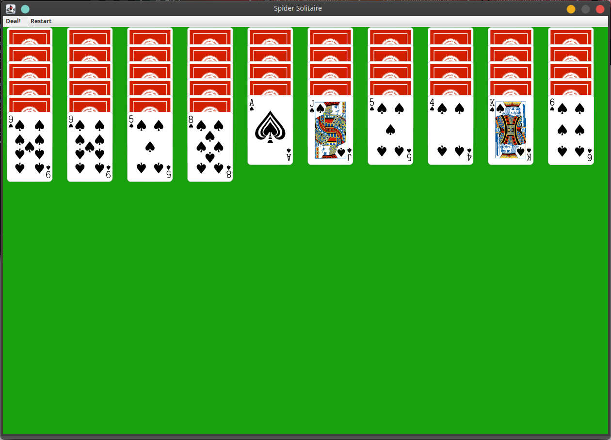

# SpiderSolitaire

Spider solitaire implemented with Java Swing, by Ryan Skylar Martin and Taylor Lundy for Professor Bob Myers' [COP3252 Advanced Java Programming](http://www.cs.fsu.edu/~myers/cop3252/) at Florida State University.

## Playing the game

The game is played with 104 cards of 1, 2, or 4 suits.  At the start of the game, ten piles are dealt, the first four containing five cards each and the last six containing four.  The top card of each pile is dealt face-up.  Cards may be moved onto a card of the next highest rank and same suit, or onto an empty space.  A stack consists of a card and all the cards beneath it.  Stacks of cards may be moved so long as their suits all match and their ranks are in descending order.  If there are no empty spaces, the player may deal one card face-up to the bottom of each pile.  Full stacks consisting of every rank in order from king to ace, all with matching suits, are removed from play.  The game is won when all cards are removed from play.
See [here](https://bicyclecards.com/how-to-play/spider-solitaire/) for another summary of game rules.

## The interface

Cards are selected by clicking.  A stack of cards may be selected by clicking the top card of the stack the player wishes to select, though the stack will not be selected if its suits do not all match and it is not strictly in decreasing order of rank.  Only one card or stack may be selected at once.  If a card or stack is already selected, clicking a card will attempt to place the card or stack onto the clicked card.  If the move is legal, it will be carried out; otherwise, the selected cards are deselected.  The player may deal by pressing the "Deal!" button in the menu bar, or start a new game by selecting the desired number of suits for the new game under the "Restart" submenu.

## Known bugs
When a pile grows too large to be contained within the window, all the piles vanish.  Adding a scrollbar to the frame didn't resolve this issue, but it can be circumvented by simply resizing the window so it can fit all its components.

## Division of labor
### Taylor Lundy implemented:

- click listening on cards and piles
- card movement logic
- stack movement logic
- deck class
- flipping the bottom card if it's unflipped
- ability to place cards on empty stacks
- various bug fixes

### Ryan Skylar Martin implemented:

- card class
- pile class
- GUI
- resolution of complete stacks
- victory check and handling
- code refactoring and optimization
- various bug fixes

... And of course all of these components contain pieces developed by each of us.
  
This project was managed using GitHub.  The repository is private, but can be made public upon request if you'd like to see the full commit history.
